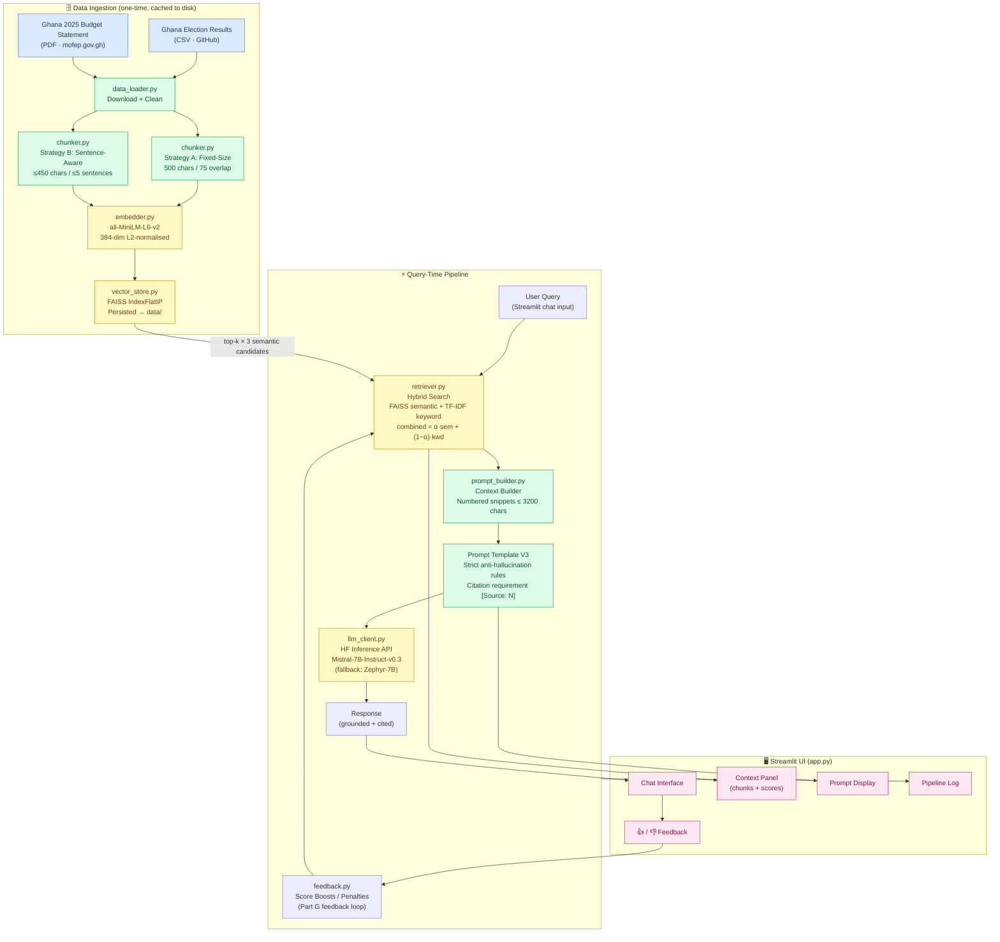

# AcityBot – Architecture Documentation (Part F)

**Author:** [YOUR_FULL_NAME] ([YOUR_INDEX_NUMBER])  
**Course:** CS4241 – Introduction to Artificial Intelligence (2026)

---

## Architecture Diagram (Mermaid)



---

## Component-Level Description

### 1. Data Ingestion (`src/data_loader.py`)
- Downloads the Ghana Election CSV from GitHub and the 2025 Budget PDF from mofep.gov.gh using `requests`.
- **CSV cleaning:** normalises column headers, drops fully empty rows, fills NaN with `"Unknown"`, converts each row to a natural-language sentence.
- **PDF cleaning:** fixes hyphenation artefacts, collapses whitespace, removes non-ASCII, skips pages shorter than 80 characters.
- Files cached in `data/`; re-downloading is skipped on subsequent runs.

### 2. Chunking (`src/chunker.py`)
| Parameter | Strategy A (Fixed) | Strategy B (Sentence) |
|-----------|-------------------|----------------------|
| Method | Sliding character window | Sentence-boundary grouping |
| Size | 500 chars | ≤ 450 chars soft limit |
| Overlap / max | 75 chars overlap | 5 sentences hard max |
| Best for | CSV row text (uniform) | PDF narrative (semantic) |

Justification for size=500 chars: at ~5 chars/token average, this yields ≈100 tokens, comfortably within `all-MiniLM-L6-v2`'s 256-token context.

### 3. Embedding (`src/embedder.py`)
- Model: `all-MiniLM-L6-v2` – fast (22 M params), 384-dim, Apache-2.0 licensed.
- Vectors are **L2-normalised** after encoding so that FAISS inner-product search equals cosine similarity.
- Batch size 64 balances throughput and memory.

### 4. Vector Store (`src/vector_store.py`)
- `faiss.IndexFlatIP` – exact (no approximation), deterministic, indexed by integer position.
- Separate index files per chunking strategy (`faiss_index_fixed.bin`, `faiss_index_sentence.bin`) allow switching strategies without invalidating the cache.
- Chunk metadata stored as JSON alongside the binary index.

### 5. Hybrid Retriever (`src/retriever.py`)
- **Semantic branch:** FAISS top-k×3 over-fetch → cosine scores.
- **Keyword branch:** scikit-learn `TfidfVectorizer` (unigrams + bigrams, `sublinear_tf=True`) built at init time over all chunk texts; query-time cosine similarity.
- **Score fusion:** `combined = α × semantic + (1−α) × keyword`.
- **Feedback boosts** from `FeedbackStore` are added before final sorting.

### 6. Prompt Builder (`src/prompt_builder.py`)
Three template iterations:
- V1: bare-bones → LLM ignores context
- V2: "use only context" + fallback phrase → better but no citations
- V3 (active): numbered snippets + `[Source: N]` citation rule + domain persona + explicit anti-hallucination prohibitions → most grounded output

Context window management: snippets are added in score order until 3,200 character budget is exhausted.

### 7. LLM Client (`src/llm_client.py`)
- Calls HuggingFace Inference API with `requests` only (no SDK).
- `return_full_text: false` ensures only generated tokens are returned.
- Auto-fallback to `zephyr-7b-beta` on HTTP errors.
- `temperature=0.1` for reproducible, factual responses.

### 8. Feedback Loop (`src/feedback.py`)  — Part G
- After each response: user clicks 👍 or 👎.
- Boost delta ±0.05 per event, capped at ±0.20.
- Adjustments persist to `logs/feedback.json` across sessions.
- Retriever applies boosts before final re-ranking.

---

## Why This Architecture Suits the Academic City Domain

1. **Factual accuracy is critical.** The election dataset contains precise vote counts, percentages, and constituency names. A pure LLM hallucinates these statistics. RAG grounds every numerical claim in a specific retrieved chunk with a source citation.

2. **Two heterogeneous sources.** CSV (structured tabular) and PDF (long-form narrative) require different chunking strategies. The configurable strategy selector in the UI lets users choose the best approach for each query type.

3. **Hybrid search for domain vocabulary.** Political acronyms (NDC, NPP) and budget line items ("DACF", "GHS") are low-frequency tokens that dense models under-represent. The TF-IDF keyword component ensures exact-match retrieval for these terms.

4. **Transparency for academic context.** All retrieved chunks, similarity scores, and the exact prompt are visible in the UI—meeting the academic integrity requirement that the grader can verify the system's reasoning chain.

5. **Low infrastructure cost.** FAISS with ~10–50 k vectors runs on a free-tier CPU. The HF Inference API is free for the model sizes used. This is appropriate for a student project deployed on Streamlit Community Cloud.

---

## Cloud Deployment Instructions

### Option A – Streamlit Community Cloud (Recommended)

1. Push your repository to GitHub (public or with collaborator access for grader).
2. Visit [share.streamlit.io](https://share.streamlit.io) → **New app**.
3. Select your repo, branch `main`, main file `app.py`.
4. Under **Advanced settings → Secrets**, add:
   ```toml
   HF_TOKEN = "hf_your_actual_token"
   ```
5. Click **Deploy**. The app URL will be `https://your-app-name.streamlit.app`.

### Option B – Hugging Face Spaces

1. Create a new Space at [huggingface.co/new-space](https://huggingface.co/new-space).
   - SDK: **Streamlit**
   - Hardware: CPU Basic (free)
2. Clone the Space repo and push your project files.
3. Add a `HF_TOKEN` repository secret under **Settings → Repository secrets**.
4. Add a `packages.txt` if `faiss-cpu` needs system libs:
   ```
   libgomp1
   ```
5. The Space URL will be `https://huggingface.co/spaces/YOUR_USERNAME/ai_[YOUR_INDEX_NUMBER]`.
